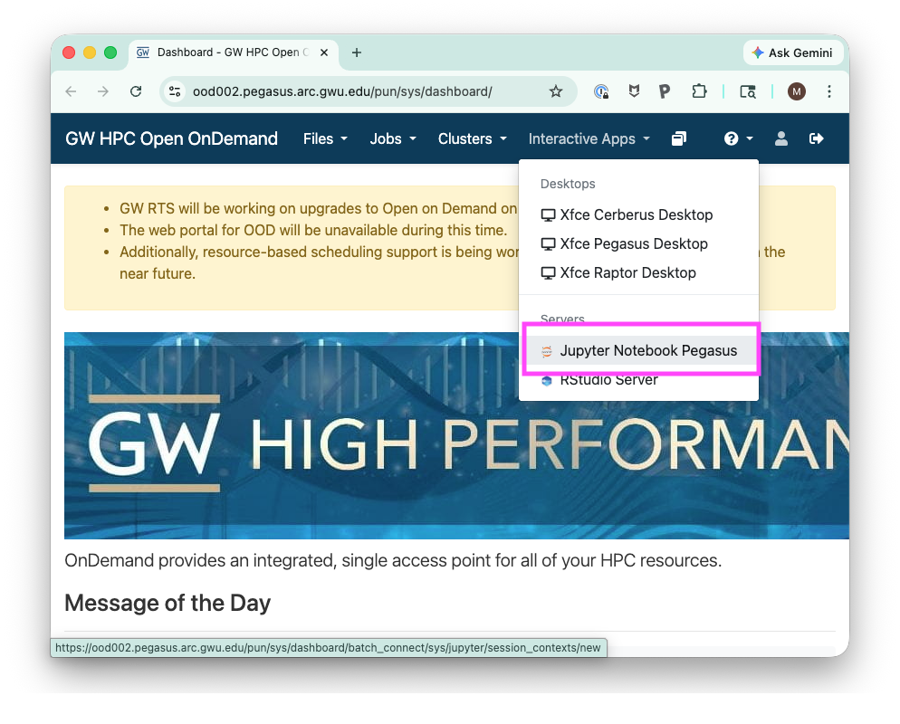
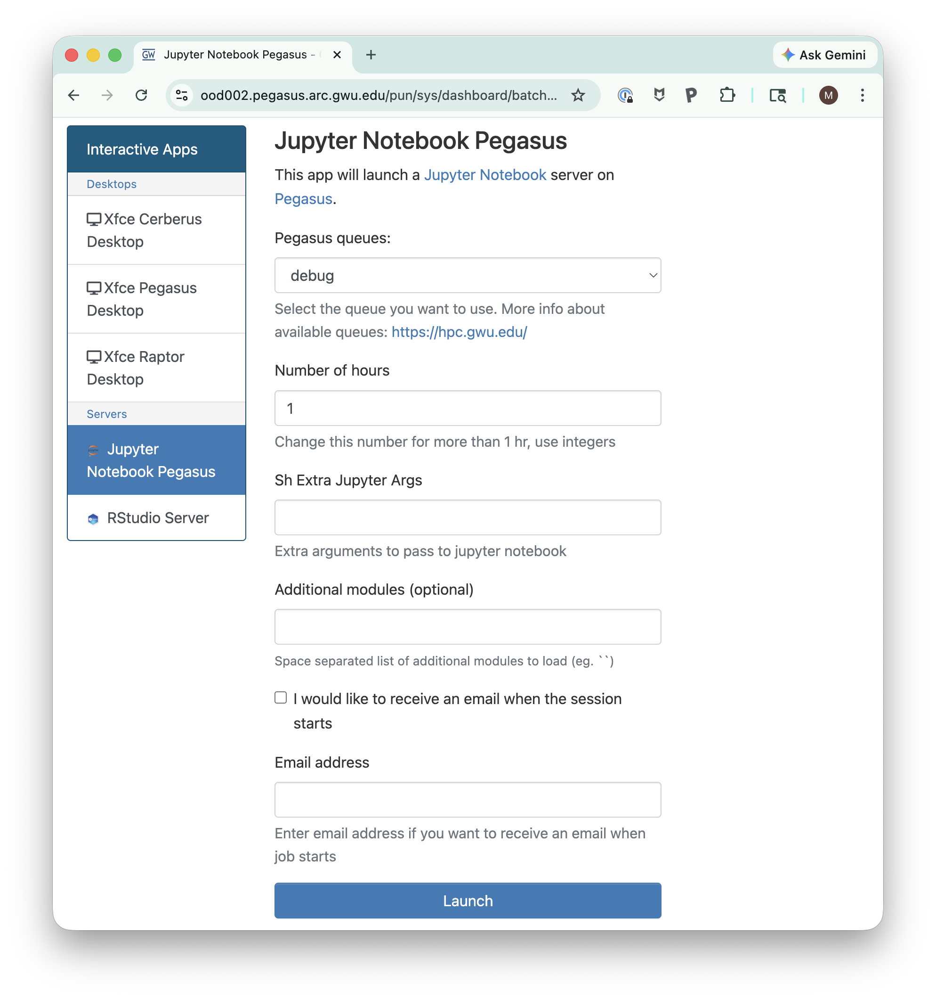
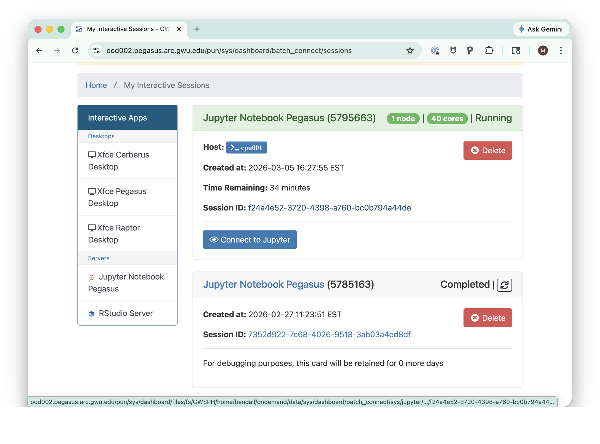

# Lab 1: scRNA-seq Data Preprocessing

## Learning Objectives

By the end of this lab, you will:
- Understand barcode structure in scRNA-seq data
- Learn about UMI (Unique Molecular Identifier) extraction
- Perform quality control on raw sequencing reads
- Process and prepare data for downstream analysis

## Background

Single-cell RNA-seq generates millions of reads per cell. Understanding the structure of sequencing reads—including cell barcodes and UMIs—is essential for proper preprocessing.

## Sections

1. **Understanding Barcodes**: Learn about 10x Genomics barcode structure
2. **UMI Extraction**: Extract and process UMI tags from reads
3. **Quality Control**: Assess read quality and filtering
4. **Data Formatting**: Prepare data for analysis in Scanpy

## Setup

This lab has its own dedicated conda environment. To set it up:

```bash
cd labs/Lab1_scRNA-seq_Preprocessing
conda env create -f environment.yml
# or:
# mamba env create -f environment.yml
```

## Running the Notebook

### Local

If you are running the notebook locally, you can simply activate the
environment and start Jupyter Notebook:

```bash
conda activate lab1-scrna-preprocessing

jupyter notebook Lab1_scRNA-seq_Preprocessing.ipynb
```

### Using GW HPC throug Open OnDemand

Assuming you have created your environment on the GW HPC cluster, you can run
Jupyter notebooks through Open OnDemand. The main difference is that the OOD version
uses the system-wide Jupyter installation, while your local version uses the Jupyter
installation in your conda environment.

We need to tell the system-wide Jupyter about our kernel by registering
our conda environment with Jupyter. 

First, register your environment kernel (from a regular SSH terminal):

```bash
python -m ipykernel install\
   --user \
   --name lab1-scrna-preprocessing \
   --display-name "lab1-scrna-preprocessing"
```

Next, sign into OOD by navigating to [GW HPC Open OnDemand](https://ood002.pegasus.arc.gwu.edu/)
Once logged in, select  **Interactive Apps > Jupyter Notebook Pegasus.**



Here you will need to select the appropriate partition and walltime 
for your job. This is just like submitting any other job on the cluster 
through SLURM (i.e. `sbatch` or `srun`).



After submitting the job, you will be presented with a page showing your
interactive jobs in the queue. Once your job starts, you can click the "Connect" button to open the 
Jupyter Notebook interface in a new tab.




## References

- [Galaxy: scRNA-seq UMIs](https://training.galaxyproject.org/training-material/topics/single-cell/tutorials/scrna-umis/tutorial.html)
- [Galaxy: scRNA-seq Preprocessing](https://training.galaxyproject.org/training-material/topics/single-cell/tutorials/scrna-preprocessing/tutorial.html)

